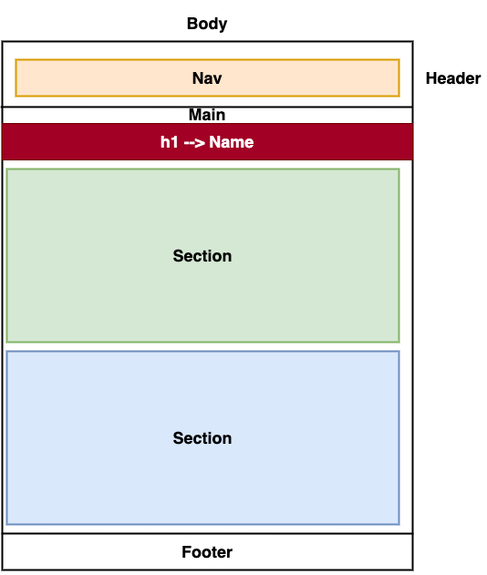
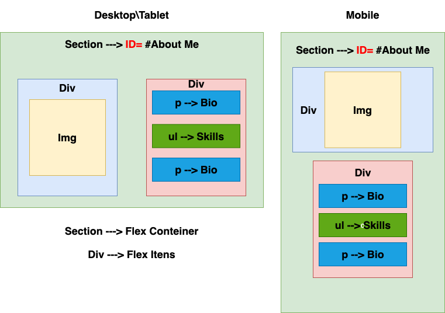

# My Professional Portfolio

## Description

This is my flat and responsive Portfolio webpage showcasing all the projects that I worked. All designed and coded by Luiz Froes.

## Deployed URL

You can view the GitHub pages deployed application [here](https://luizfroes.github.io/my-portfolio-webpage/)

## Technologies Used

- HTML5
- CSS
- Font Awesome

## Screenshots

### Layout Designs

### Final Website

